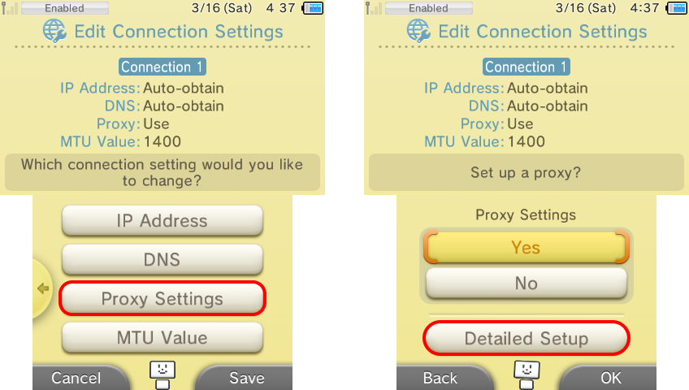
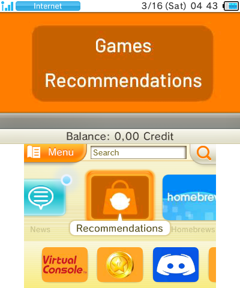

### __Ghost eShop 3DS BETA configuration :__

**📙 Read more :**

*To get everything up and running, please follow this guide **step by step***.

**Reminders:**
* If you don't know what a 3DS is (which you won't if you're here 😂), here's the wonderful Wikipedia page: [here](https://fr.wikipedia.org/wiki/Nintendo_3DS).
* And finally, Ghost eShop Team is in no way responsible for any damage you may cause to your console or anything else. Normally, if you follow this guide properly, you won't have any problems, but if you do, you can always contact the Ghost eShop Team by joining [the Discord server](https://discord.gg/ENFGnYrKMf).
**If you don't know what you're doing, don't do it or let someone else do it.**

___
#### 🏁 1- Prerequisites :
To install the beta version of Ghost eShop 3DS, you will need the following :

* A console modded with luma🏴‍☠️. (See [here](https://3ds.hacks.guide/))
* And finally, a little patience...

___
#### 2- Setting up access to BETA :

* **First step :**

    Place [this patch](https://raw.githubusercontent.com/InternalLoss/3DS-SSL-Patch/master/code.ips) in your 3DS (micro) SD card in the following location: ``sd:/luma/sysmodules/0004013000002F02.ips``. Create the ``luma/sysmodules`` folder if it does not already exist:
    

* **Second Step :**

    Once this has been done, put your (micro) SD card back into your console, then start your console and press the ``Select`` button on your console to access the Luma configuration menu.
* **Third step :**

    Once in the Luma configuration menu, make sure you have selected "Enbale loading external FIRMs and modules" as shown in the image, and then press the ``Start`` button to save the configuration and restart the console.
    

* **Fourth step :**

    Once the console is fully powered up, open System Settings, then go to ``Internet Settings > Connection Settings``.
* **Fifth step :**

    Create a new connection (if you don't already have one) and select your current connection (for example, ``Connection 1``).
* **Sixth step :**

    Once in the connection settings, select ``Change Settings``, then on the second page click on ``Proxy Settings``, select ``Yes`` to enable it, and then select ``Detailed Setup``.
    

* **Seventh step :**

    Configure the proxy as shown in the screenshot below:
    

* **Step n°8 :**

    Select ``OK`` in the bottom right-hand corner of the screen, then on ``Save``, then test your connection. If all goes well, you'll see the screenshot below:
    

* **Step n°9 :**

    Exit System Settings and return to your console's home menu. To avoid any potential bugs or errors, restart your console.
* **Step n°10 :**

    Once all this is done, you should be able to access the eShop.
    

* **Step n°11 :**

    Once in the eShop, press ``Menu`` (top left of the lower console screen), then scroll down to ``Settings/Other`` and select it.
* **Step n°12 :**

    Then scroll down to the ``History`` section and select ``Account Activity``, you should get a fake error message displaying your 3DS Key, as shown below.
    

* **Step n°13 :**

    With a PC or mobile device, access [this page](https://ghseshop.cc/signup). You should see something like this:
    

* **Step n°14 :**

    You'll need to register for an account by entering the following:
    - A user name
    - An email, in case of a problem or account recovery request (**no account recovery can be done without a valid email!**) 
    - Your 3DS Key that was mentioned earlier
    - A password (Tip: do not put passwords used other passwords, do not put for example the same password as your email address ...).
* **Step n°15 :**

    Once you've done that, you can click on the ``SIGN UP`` button, then log in if you're not.
    You should see the screenshot below:
    

* **Last Step :**

    Enjoy ☺️​

Now that you have access to the Ghost eShop 3DS beta, you shouldn't have to worry about Nintendo wiping out all the great games on the console of our childhood.

Please note:
- The proxy is and will remain active for beta and development purposes only, and will subsequently be replaced by a full eShop patch.
- As this is currently only a beta, we'll give you all the support we can in the event of a problem, but we're not responsible for any damage your console may suffer as a result of improper handling.

