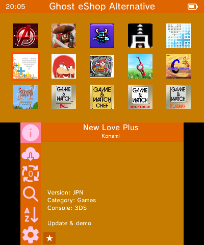

### __Añadir la base de datos de Ghost eShop DS desde el homebrew Ghost eShop :__

**📙 Para leer :**

*Para que todo funcione, sigue esta guía **paso a paso***.

**Recordatorios :**
* Si no sabes lo que es una 3DS (que lo sabrás si estás aquí 😂), pues aquí tienes la maravillosa página de Wikipedia : [aquí](https://es.wikipedia.org/wiki/Nintendo_3DS).
* Y para terminar los recordatorios, Ghost eShop Team no se hace responsable en ningún caso de cualquier daño que puedas causar a tu consola u otro, normalmente si sigues bien esta guía, no tendrás problemas, pero si resultara haber algún problema, siempre puedes contactar con el staff de Ghost eShop Team uniéndote a [el servidor discord](https://discord.gg/ENFGnYrKMf).
**Si no sabes lo que haces, no lo hagas o deja que otro lo haga.**

___
#### 🏁 1- Requisitos previos :
Para poder instalar el homebrew de Ghost eShop, necesitarás :

* Una consola modded 🏴‍☠️. (Ver [aquí](https://3ds.hacks.guide/))
* Tener instalado el homebrew Ghost eShop, para instalarlo, puedes encontrar una guía [aquí](./first_install.md)
* Y por último, un poco de paciencia...

___
#### 2- Adding the Database :

* **Primer paso :**

    Iniciar el homebrew Ghost eShop
    

* **Segundo paso :**

    Ir a la configuración de homebrew
    

* **Tercer paso :**

    Ir a seleccionar eShop
    

* **Cuarto paso :**

    Haga clic en el icono "**+**". 
* **Quinto paso :**

    Pulsa Ghost eShop DS
    

* **Sexto paso :**

    Espere a que finalice la descarga (y asegúrese de que la consola está conectada a internet, si no es así no mostrará la lista de persianas)
    

* **Séptimo paso :**

    Después de descargar haga clic en "ghosteshop-ds.unistore".
    

* **Último paso :**

    Disfruta ☺️
    

Eso es todo, la base de datos de Ghost eShop DS ya está añadida a tu homebrew de Ghost eShop.

Y si quieres cambiar la base de datos, solo tienes que volver a los ajustes de homebrew, luego en "seleccionar eshop", y luego hacer clic en la base de datos que quieras mostrar.

