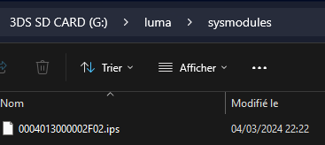
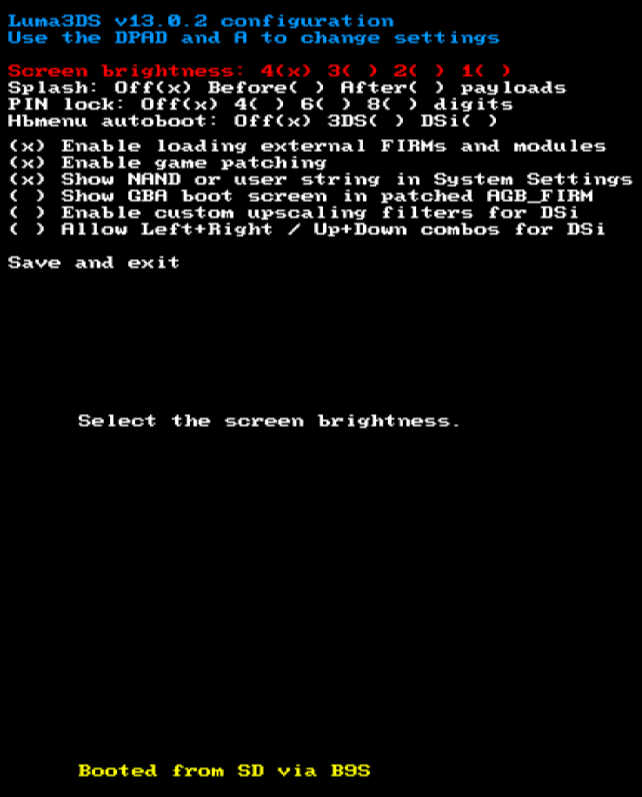
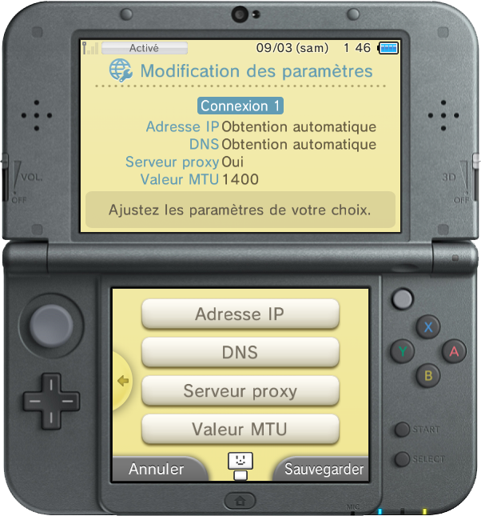
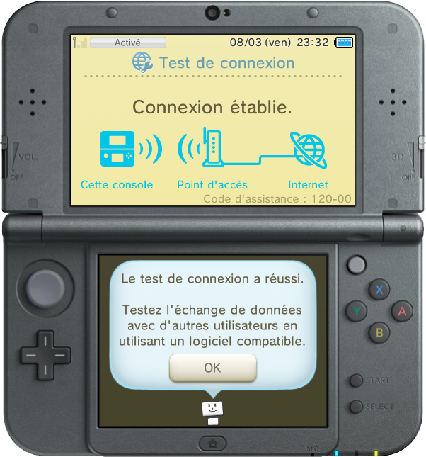
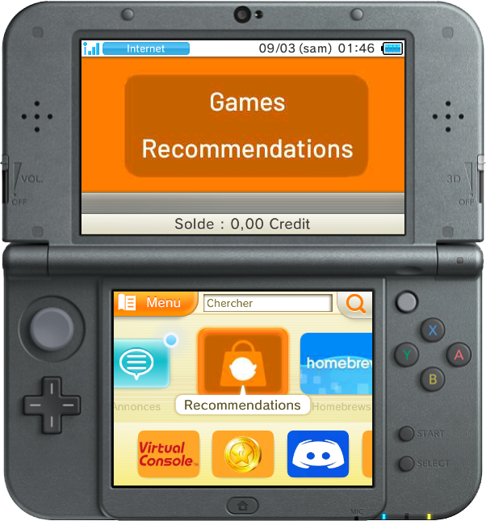
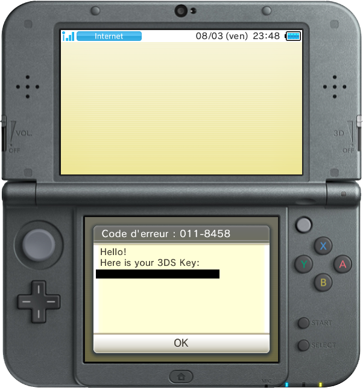
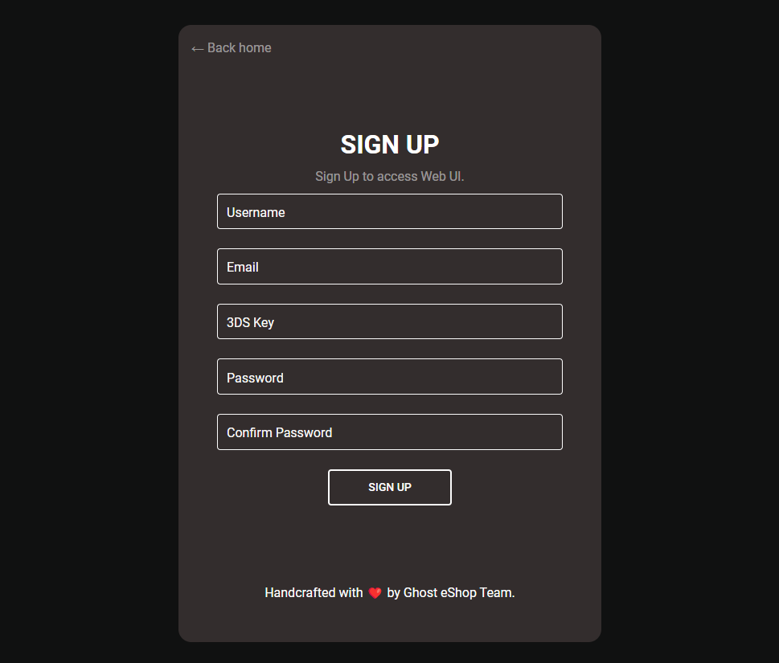

### __Configuration de Ghost eShop 3DS BETA :__

**📙 À lire :**

*Pour que tout fonctionne, veuillez suivre ce guide **étape par étape***

**Rappels :**
* Si vous ne savez pas ce qu'est une 3DS (ce qui m'étonnerait vu que vous êtes ici 😂), alors voici sa magnifique page de Wikipedia : [ici](https://fr.wikipedia.org/wiki/Nintendo_3DS)
* Afin que vous compreniez au mieux ce guide, il vous faut savoir que les mots ou groupe de mots [soulignés et de couleur bleu]() sont des hyperliens, et donc en cliquant dessus, celà vous redirigera vers une autre page (par exemple : [FBI](https://github.com/lifehackerhansol/FBI) qui est le github de lifehackeransol (qui est un fork comme le lien officiel de FBI a sauté). Pour plus de précisions, veuillez lire [cette documentation markdown](https://cours-web.ch/divers/markdown/)
* Et pour finir les rappels, Ghost eShop Team n'est en aucun cas responsable d'éventuels dommages que vous pourriez causer à votre système, normalement si vous suivez bien ce guide, vous n'aurez aucun problèmes, mais si vous en rencontrez un, vous pouvez toujours contacter le staff de Ghost eShop Team en rejoignant [le serveur discord](https://discord.gg/a7vdfT6YPq).
**Si vous ne savez pas ce que vous faites, ne le faites pas ou alors faites vous guider**

___
#### 🏁 1- Prérequis :
Pour installer la version beta de Ghost eShop 3DS, vous aurez besoin :

* D'ne console hackée avec luma 🏴‍☠️ (voir [ici](https://3ds.hacks.guide/fr_FR))
* Et enfin, d'un peu de patience...

___
#### 2- Mise en place de l'accès à la BETA :

* **Première étape :**

    Placez [ce patch](https://raw.githubusercontent.com/InternalLoss/3DS-SSL-Patch/master/code.ips) dans la carte (micro) SD de votre 3DS dans le dossier ``SD:\luma\sysmodules`` et renommez-le en ``0004013000002F02.ips`` afin d'avoir quelque chose comme ça :
    

* **Deuxième étape :**

    Une fois cela fait, remettez la carte (micro) SD dans votre console, ensuite démarrez votre console en appuyant sur le bouton ``select`` de votre console afin d'accèder au menu de configuration de luma
* **Troisième étape :**

    Une fois sur le menu de configuration de luma soyez sûr d'avoir sélectionné "Enable loading external FIRMs and modules" comme sur l'image et d'avoir ensuite appuyé sur le bouton ``start`` afin de sauvegarder la configuration et redémarrer la console
    

* **Quatrième étape :**

    Une fois la console complètement allumée, allez dans : ``Paramètres de la console > Paramètres Internet > Paramètres de connexion``
* **Cinquième étape :**

    Vous avez ensuite deux choix, soit cliquez sur ``Nouvelle connexion`` si votre console n'est pas déjà connectée à internet pour pouvoir le faire, soit cliquez sur votre connexion actuelle (pour moi ce sera par exemple ``Connexion 1``).
* **Sixième étape :**

    Une fois dans les paramètres de votre connexion, cliquez sur ``Modifier``, puis sur la deuxième page cliquez sur ``Serveur proxy``, cliquer sur ``Oui`` et ensuite sur ``Paramètres avancés``
    

* **Septième étape :**

    Configurez ensuite le proxy comme sur la capture d'écran juste en dessous :
    

* **Huitième étape :**

    Cliquez ensuite sur ``OK`` en bas à droite de l'écran du bas, puis sur ``Sauvegarder`` et testez ensuite votre connexion. Si tout est bon, vous aurez un message comme ça :
    

* **Neuvième étape :**

    Retournez ensuite sur le menu home de votre console et afin d'éviter d'éventuel bug ou erreur, rédémarrez votre console
* **Etape n°10 :**

    Une fois tout cela fais, vous devriez pouvoir accèder à l'eShop
    

* **Etape n°11 :**

    Une fois dans l'eShop, appuyez sur ``Menu`` (en haut à gauche de l'écran inférieur de la console), puis descendez jusqu'à ``Paramètres/Autres``
* **Etape n°12 :**

    Descendez ensuite jusqu'à la partie ``Historique`` et cliquez sur ``Activités sur votre compte``, vous aurez normalement un faux message d'erreur affichant votre clé 3DS (3DS Key), comme ça
    

* **Etape n°13 :**

    Depuis un PC, accèdez à [cette page](https://ghseshop.cc/signup). Vous devriez tomber sur cette page :
    

* **Etape n°14 :**

    Vous allez donc devoir vous inscrire en rentrant : Un nom d'utilisateur, une adresse email si possible valide en cas de problèmes ou de demande de récupération de compte (**aucune récupération de compte ne pourra être faite sans une adresse email valide**), votre clé 3DS que vous devriez voir actuellement sur votre 3DS ou que vous avez noté quelque part et pour finir un mot de passe (conseil : ne mettez pas un mot de passe souvent utilisé, par exemple le même mot de passe que votre adresse email...)
* **Etape n°15 :**

    Une fois cela fait, vous pouvez cliquer sur le bouton ``SIGN UP`` puis vous connecter si vous ne l'êtes pas déjà
    Vous devriez voir quelque chose comme ça :
    

* **Dernière étape :**

    Enjoy ☺️​

Voilà, vous avez désormait accès à la beta de Ghost eShop 3DS et vous devriez normalement ne plus avoir peur que Nintendo fasse disparaitre tous les magnifiques jeux de cette console de notre enfance

À prendre en compte :
- Le proxy ne sert et ne sera actif que pour la beta et pour du dévelopement, il sera par la suite remplacé par un patch complet de l'eShop
- Étant donné que cela reste actuellement qu'une beta, nous vous apporterons tout le soutient et l'aide possible en cas de problème mais ne sommes pas responsable des dommages qu'une mauvaise manipulation de votre part pourrait apporter à votre système

