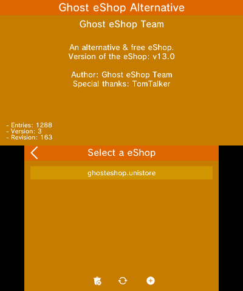

### __Adding the Ghost eShop DS database from the Ghost eSHop homebrew :__

**📙 To read :**

*In order for everything to work, please follow this guide **step by step***.

**Reminders :**
* If you don't know what a 3DS is (which you will if you are here 😂), then here is the wonderful Wikipedia page : [here](https://ja.m.wikipedia.org/wiki/%E3%83%8B%E3%83%B3%E3%83%86%E3%83%B3%E3%83%89%E3%83%BC3DS)..
* And to finish the reminders, Ghost eShop Team is in no way responsible for any damage you may cause to your console or other, normally if you follow this guide well, you will have no problems, but if there proved to be a problem, you can always contact the staff of Ghost eShop Team by joining [the server discord](https://discord.gg/ENFGnYrKMf).
**If you don't know what you are doing, don't do it or let someone else do it.**

___
#### 🏁 1- Prerequisites :
In order to install the Ghost eShop homebrew, you will need :

* A modded console 🏴‍☠️. (See [here](https://3ds.hacks.guide/))
* Have installed the Ghost eShop homebrew, to install it, you can find a guide [here](./first_install.md)
* And finally, a little patience...

___
#### 2- Adding the Database :

* **First step :**

    Start the Ghost eShop homebrew
    

* **Second step :**

    Go to the homebrew settings
    

* **Third step :**

    Go to select eShop
    

* **Fourth step :**

    Click on the "**+**" icon 
* **Fifth step :**

    Press Ghost eShop DS
    

* **Sixth step :**

    Wait for the end of the download (and be sure that the console is connected to the internet, if it is not the case it will not display the list of blinds)
    

* **Seventh step :**

    After downloading click on "ghosteshop-ds.unistore".
    

* **Last step :**

    Enjoy ☺️​
    

That's it, the Ghost eShop DS database is now added to your Ghost eShop homebrew.

And if you want to change the database, you just have to go back to the homebrew settings, then on "select eshop", then click on the database you want to display.

